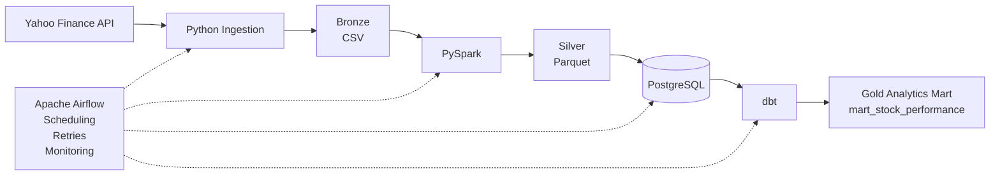

# Financial Markets Data Platform

An end-to-end data engineering pipeline that incrementally ingests financial market data, processes and validates it with PySpark, stores analytics-ready data in PostgreSQL, transforms it with dbt, and orchestrates the workflow with Apache Airflow.

## Key Features

- **Incremental ingestion** of daily stock market data from Yahoo Finance using Python.
- **Bronze/Silver/Gold architecture** separating raw, cleaned, and analytics-ready data.
- **PySpark transformations** for schema enforcement, validation, deduplication, and reference-data enrichment.
- **Parquet storage** for cleaned Silver-layer datasets.
- **PostgreSQL data warehouse** containing stock prices and company reference data.
- **dbt transformations** for staging and analytics models, including daily returns and 5-day moving averages.
- **Automated data quality tests** validating uniqueness, null values, price ranges, and analytics outputs.
- **Apache Airflow orchestration** with weekday scheduling, task dependencies, automatic retries, and failure handling.
- **Pipeline observability** through audit logging of run status, timestamps, and error messages.
- **Dockerized environment** for reproducible local execution of PostgreSQL, Spark, and Airflow.

## Architecture



## Data Pipeline

### 1. Ingestion
Python retrieves historical and daily stock-price data from Yahoo Finance for a configured set of companies. The ingestion process determines the latest date already stored for each ticker and requests only new data, preventing unnecessary reprocessing.

Raw data is stored in the Bronze layer using ingestion-date partitions:

`data/bronze/stock_prices/year=YYYY/month=MM/day=DD/`

### 2. Bronze → Silver Processing
PySpark reads the raw CSV files using an explicit schema and applies data-quality transformations, including:

- Removing duplicate ticker/date records
- Validating positive price and volume values
- Ensuring high prices are not below low prices
- Joining company reference data such as sector, industry, and exchange

Validated and enriched records are written to the Silver layer in Parquet format.

### 3. PostgreSQL Loading
Silver data is loaded into PostgreSQL using an idempotent loading process.

Stock prices use `(ticker, trade_date)` as the primary key, preventing duplicate market records across repeated pipeline runs. Company metadata is upserted so reference information can be updated without creating duplicate companies.

### 4. Analytics Transformation
dbt transforms the PostgreSQL source tables into analytics-ready models.

The Gold-layer `mart_stock_performance` model combines company information with stock-price data and calculates:

- Daily percentage return
- 5-day moving average

### 5. Data Quality
dbt tests validate the pipeline before a run is considered successful. Tests cover:

- Required fields
- Unique company tickers
- Unique `(ticker, trade_date)` combinations
- Valid stock-price ranges
- Valid Gold-layer analytics outputs

### 6. Orchestration & Observability
Apache Airflow orchestrates the complete workflow on a weekday schedule:

`Ingestion → PySpark → PostgreSQL → dbt run → dbt test`

Tasks automatically retry after failures. Pipeline runs are also recorded in PostgreSQL with the Airflow run ID, start and end timestamps, final status, and error information for failed runs.


## Tech Stack

| Technology | Role |
| --- | --- |
| Python | Incremental market data ingestion and database loading |
| Yahoo Finance | Financial market data source |
| Apache Spark / PySpark | Distributed data validation, transformation, and enrichment |
| CSV | Raw Bronze-layer storage |
| Parquet | Cleaned Silver-layer storage |
| PostgreSQL | Relational and analytics storage |
| dbt | SQL transformations, analytics modeling, and data quality testing |
| Apache Airflow | Pipeline orchestration, scheduling, retries, and failure handling |
| Docker | Containerized local development environment |
| Git / GitHub | Version control and project documentation |

## Data Model

### `stock_prices`

Stores validated historical stock-price observations.

| Column | Description |
| --- | --- |
| `ticker` | Stock ticker symbol |
| `trade_date` | Trading date |
| `open_price` | Opening price |
| `high_price` | Daily high |
| `low_price` | Daily low |
| `close_price` | Closing price |
| `adjusted_close` | Adjusted closing price |
| `volume` | Daily trading volume |
| `ingestion_timestamp` | Timestamp when the record was ingested |

**Primary key:** `(ticker, trade_date)`

### `companies`

Stores company reference data used to enrich stock-price records.

| Column | Description |
| --- | --- |
| `ticker` | Stock ticker symbol |
| `company_name` | Company name |
| `sector` | Market sector |
| `industry` | Industry classification |
| `exchange` | Stock exchange |

**Primary key:** `ticker`

### `mart_stock_performance`

Gold-layer dbt model containing analytics-ready stock performance metrics.

| Column | Description |
| --- | --- |
| `ticker` | Stock ticker symbol |
| `company_name` | Company name |
| `sector` | Market sector |
| `industry` | Industry classification |
| `exchange` | Stock exchange |
| `trade_date` | Trading date |
| `close_price` | Closing price |
| `volume` | Daily trading volume |
| `daily_return_pct` | Percentage change from the previous trading day's close |
| `moving_avg_5d` | Rolling 5-trading-day average closing price |

### `pipeline_runs`

Stores pipeline execution metadata for observability and failure tracking.

| Column | Description |
| --- | --- |
| `run_id` | Internal audit record ID |
| `pipeline_name` | Name of the pipeline |
| `dag_run_id` | Airflow DAG run identifier |
| `start_time` | Pipeline start timestamp |
| `end_time` | Pipeline completion timestamp |
| `status` | Pipeline status (`RUNNING`, `SUCCESS`, or `FAILED`) |
| `rows_inserted` | Number of records inserted when applicable |
| `error_message` | Error captured when a pipeline run fails |


## Project Structure

```text
financial-market-data-platform/
│
├── airflow/
│   ├── audit_utils.py                   # Pipeline run audit logging
│   └── market_data_pipeline.py          # Airflow DAG and orchestration
│
├── data/
│   └── reference/
│       └── companies.csv                # Company metadata for enrichment
│
├── dbt/
│   └── market_analytics/
│       ├── models/
│       │   ├── marts/
│       │   │   └── mart_stock_performance.sql
│       │   └── staging/
│       │       ├── schema.yml           # Staging model tests
│       │       ├── sources.yml          # PostgreSQL source definitions
│       │       ├── stg_companies.sql
│       │       └── stg_stock_prices.sql
│       │
│       ├── tests/
│       │   ├── assert_unique_stock_prices.sql
│       │   ├── assert_valid_stock_performance.sql
│       │   └── assert_valid_stock_prices.sql
│       │
│       ├── dbt_project.yml              # dbt project configuration
│       └── profiles.yml                 # PostgreSQL connection configuration
│
├── docker/
│   └── Dockerfile.airflow               # Airflow container configuration
│
├── ingestion/
│   ├── fetch_market_data.py             # Incremental Yahoo Finance ingestion
│   └── load_silver_to_postgres.py       # Silver → PostgreSQL loading
│
├── spark/
│   └── transform_stock_prices.py        # Bronze → Silver PySpark processing
│
├── sql/
│   └── init.sql                         # PostgreSQL table definitions
│
├── .env.example                         # Environment variable template
├── .gitignore                           # Files excluded from version control
├── docker-compose.yml                   # Multi-container environment
├── Dockerfile.spark                     # Spark container configuration
├── requirements.txt                     # Python dependencies
└── README.md                            # Project documentation
```

> Bronze CSV and Silver Parquet datasets are generated at runtime and excluded from version control.

## Running Locally

### Prerequisites

- Docker Desktop
- Docker Compose
- Git

### 1. Clone the repository

```bash
git clone <repository-url>
cd financial-market-data-platform
```

### 2. Configure environment variables

Copy the provided environment template:

```bash
cp .env.example .env
```

Update `.env` with the desired PostgreSQL credentials.

### 3. Build and start the services

```bash
docker compose up -d --build
```

This starts the project's PostgreSQL, Spark, Airflow webserver, and Airflow scheduler containers.

### 4. Open Airflow

Navigate to:

`http://127.0.0.1:8080`

Enable and trigger the `financial_market_data_pipeline` DAG.

### 5. Pipeline Execution

Airflow executes the pipeline in the following order:

```text
start_audit
    ↓
fetch_market_data
    ↓
bronze_to_silver
    ↓
load_silver_to_postgres
    ↓
dbt_run
    ↓
dbt_test
    ↓
finish_audit
```

A successful run ingests new market data, processes the Bronze and Silver layers, loads PostgreSQL, builds the dbt analytics models, runs data-quality tests, and records the pipeline execution status.
