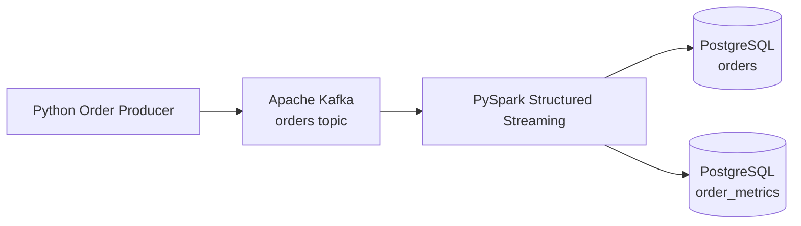

# Real-Time E-Commerce Streaming Pipeline

A real-time data engineering project that simulates e-commerce order events, streams them through Apache Kafka, processes them with PySpark Structured Streaming, and stores validated orders and streaming metrics in PostgreSQL.

## Key Features

- Real-time event generation with Python
- Apache Kafka event streaming
- PySpark Structured Streaming transformations
- Data validation and enrichment
- Idempotent PostgreSQL writes
- Event-time processing with 5-minute windows
- Watermarking for late-arriving events
- Streaming aggregations for revenue and order metrics
- Spark checkpointing and restart recovery
- Dockerized local environment

## Architecture



## Pipeline Flow

### 1. Event Generation

A Python producer generates simulated e-commerce orders containing:

- Order ID
- Customer ID
- Product ID
- Category
- Quantity
- Unit price
- Order timestamp
- Payment method
- Order status

Events are serialized as JSON and published to the Kafka `orders` topic.

### 2. Kafka Streaming

Apache Kafka acts as the event transport layer between the producer and Spark.

The `orders` topic persists incoming events so downstream consumers can process them independently.

### 3. PySpark Structured Streaming

Spark continuously consumes Kafka events and:

- Parses JSON using an explicit schema
- Validates required fields
- Rejects invalid quantities and prices
- Validates order status
- Calculates `order_total`
- Converts timestamps for event-time processing

### 4. PostgreSQL Orders

Validated orders are written to PostgreSQL.

The `order_id` primary key and PostgreSQL `ON CONFLICT DO NOTHING` logic make writes idempotent and prevent duplicate events from creating duplicate records.

### 5. Streaming Aggregations

Completed orders are aggregated using 5-minute event-time windows.

Metrics include:

- Order count
- Total revenue
- Average order value
- Revenue by product category

A 10-minute watermark is used to manage late-arriving events.

### 6. Fault Tolerance

Spark checkpoint directories store streaming offsets and aggregation state.

If the Spark job stops while events continue arriving in Kafka, the stream resumes from its saved checkpoint and processes the unprocessed events after restarting.

## Tech Stack

- Python
- Apache Kafka
- PySpark
- Spark Structured Streaming
- PostgreSQL
- Docker
- Docker Compose

## Data Model

### `orders`

| Column | Description |
|---|---|
| `order_id` | Unique order identifier |
| `customer_id` | Customer identifier |
| `product_id` | Product identifier |
| `category` | Product category |
| `quantity` | Number of units |
| `unit_price` | Price per unit |
| `order_total` | Quantity × unit price |
| `order_timestamp` | Event timestamp |
| `payment_method` | Payment method |
| `status` | Order status |
| `processed_timestamp` | PostgreSQL ingestion timestamp |

### `order_metrics`

| Column | Description |
|---|---|
| `window_start` | Start of 5-minute event-time window |
| `window_end` | End of 5-minute event-time window |
| `category` | Product category |
| `order_count` | Completed orders in the window |
| `total_revenue` | Revenue generated in the window |
| `avg_order_value` | Average order value |

## Project Structure

```text
real-time-ecommerce-pipeline/
│
├── producer/
│   └── generate_orders.py
│
├── streaming/
│   └── process_orders.py
│
├── sql/
│   └── init.sql
│
├── docker/
│   └── Dockerfile.spark
│
├── data/
│
├── docker-compose.yml
├── .env.example
├── .gitignore
├── requirements.txt
└── README.md
```

## Running Locally

### 1. Create the Environment File

Copy `.env.example` to `.env` and configure the PostgreSQL environment variables:

```env
POSTGRES_USER=ecommerce_user
POSTGRES_PASSWORD=your_password_here
POSTGRES_DB=ecommerce
POSTGRES_PORT=5433
```

### 2. Start the Infrastructure

```bash
docker compose up -d --build
```

This starts:

- Apache Kafka
- PostgreSQL
- Apache Spark

### 3. Create the Kafka Topic

```bash
MSYS_NO_PATHCONV=1 docker exec -it ecommerce_kafka /opt/kafka/bin/kafka-topics.sh \
  --bootstrap-server localhost:9092 \
  --create \
  --topic orders \
  --partitions 1 \
  --replication-factor 1
```

Verify the topic:

```bash
MSYS_NO_PATHCONV=1 docker exec -it ecommerce_kafka /opt/kafka/bin/kafka-topics.sh \
  --bootstrap-server localhost:9092 \
  --list
```

### 4. Start the Spark Streaming Job

```bash
MSYS_NO_PATHCONV=1 docker exec -it ecommerce_spark spark-submit \
  --packages org.apache.spark:spark-sql-kafka-0-10_2.12:3.5.1 \
  /app/streaming/process_orders.py
```

Spark begins listening for events from the Kafka `orders` topic.

### 5. Start Producing Events

In another terminal:

```bash
python producer/generate_orders.py
```

The producer continuously generates simulated orders and publishes them to Kafka.

Orders then flow through the pipeline:

```text
Python Producer
      ↓
Apache Kafka
      ↓
PySpark Structured Streaming
      ↓
Validation & Transformation
      ↓
PostgreSQL
      ↓
Real-Time Metrics
```

Stop the producer with `Ctrl+C`.

## Reliability

The pipeline includes several mechanisms for reliable stream processing:

- **Kafka persistence** retains events independently of downstream consumers.
- **Spark checkpoints** track streaming offsets and aggregation state.
- **Idempotent PostgreSQL writes** prevent duplicate order records.
- **Event-time processing** aggregates events based on when orders occurred.
- **Watermarking** manages late-arriving events and streaming state.
- **Restart recovery** allows Spark to resume processing events that arrived while the consumer was unavailable.

The pipeline was tested by stopping the Spark streaming job, continuing to publish events to Kafka, and restarting Spark. The consumer resumed from its checkpoint and processed the events that arrived during downtime without creating duplicate order records.